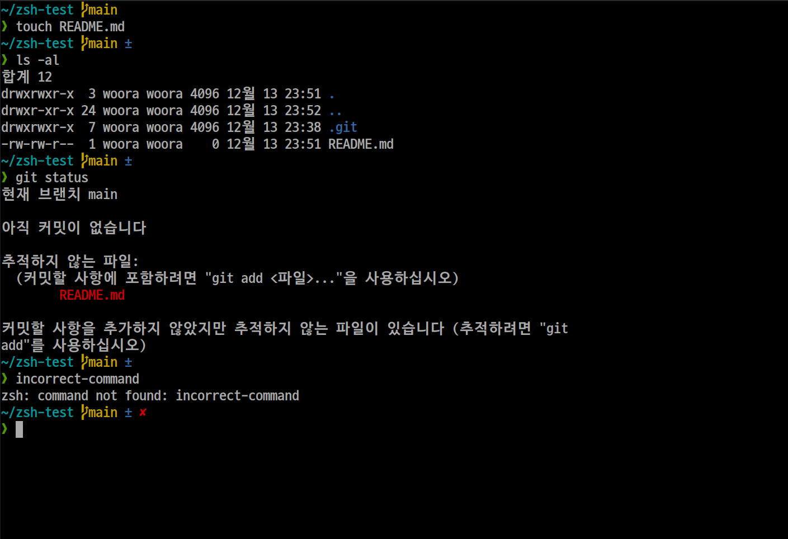
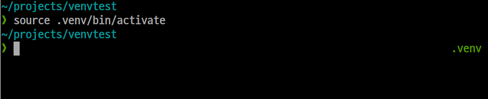

# devj121-zsh-theme

## Image



## Installation
Copy and paste these commands:
```git clone https://github.com/DevJ121/devj121-zsh-theme.git
cd devj121-zsh-theme
mv devj121.zsh-theme ~/.oh-my-zsh/custom/themes/devj121.zsh-theme
cd ..
rm -rf devj121-zsh-theme
```

Then, modify your ```.zshrc``` file.

Find ```ZSH_THEME="..."``` line and modify it as ```ZSH_THEME="devj121"```.

